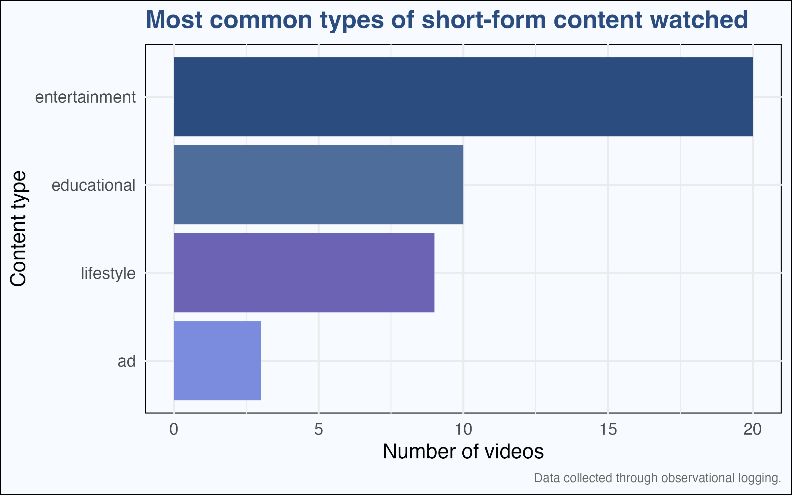
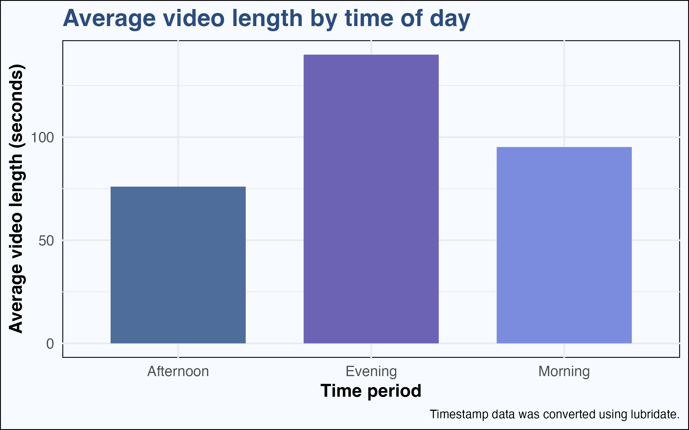
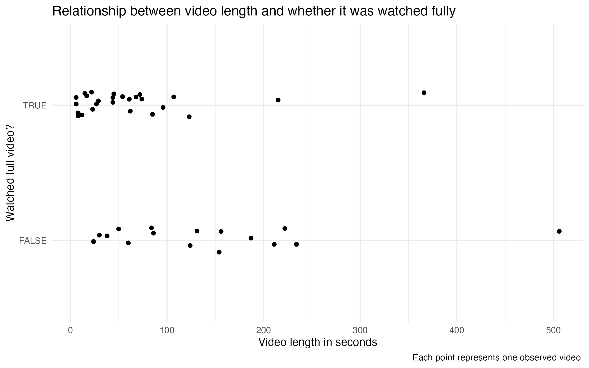

<script src="https://code.jquery.com/jquery-3.7.1.min.js" integrity="sha256-/JqT3SQfawRcv/BIHPThkBvs0OEvtFFmqPF/lYI/Cxo=" crossorigin="anonymous"></script>

```{r setup, include=FALSE}
knitr::opts_chunk$set(echo=FALSE, message=FALSE, warning=FALSE, error=FALSE)
```

```{js}
$(function() {
  $(".level2").css('visibility', 'hidden');
  $(".level2").first().css('visibility', 'visible');
  $(".container-fluid").height($(".container-fluid").height() + 300);
  $(window).on('scroll', function() {
    $('h2').each(function() {
      var h2Top = $(this).offset().top - $(window).scrollTop();
      var windowHeight = $(window).height();
      if (h2Top >= 0 && h2Top <= windowHeight / 2) {
        $(this).parent('div').css('visibility', 'visible');
      } else if (h2Top > windowHeight / 2) {
        $(this).parent('div').css('visibility', 'hidden');
      }
    });
  });
})
```

```{css, echo=FALSE}
body {
  background-color: #F7FBFF;
  color: #222222;
  font-family: Arial, sans-serif;
}

h1 {
  color: #2B4C7E;
  text-align: center;
  font-weight: bold;
}

h2 {
  color: #4F6D9A;
  margin-top: 80px;
  font-weight: bold;
}

p {
  font-size: 18px;
  line-height: 1.7;
}

img {
  max-width: 100%;
  border-radius: 14px;
  margin-top: 20px;
  margin-bottom: 20px;
}

.figcaption {
  display: none;
}
```

## What's going on with this data?

## Introduction
Short-form video platforms are designed to capture attention quickly. For this project, I observed my own short-form video watching behaviour over time using a Google Form.

For each video, I recorded the type of content, the video length in seconds, whether I watched the full video, how engaging I found the video, and the timestamp of the observation.

This visual data story explores what types of short-form videos appeared most often, how video length varied across the day, and whether video length seemed to affect whether I watched the full video.

## What type of content appeared most often?




Entertainment videos appeared most often in my observations. Educational and lifestyle videos were also common, while advertisements appeared less frequently.

This suggests that my short-form video feed was mostly made up of entertainment-based content, which may reflect how short-form platforms prioritise quick and engaging videos.

## Did video length change across the day?



This visualisation uses the timestamp data from my Google Form. I used the `{lubridate}` package to convert timestamps into time periods: morning, afternoon, and evening.

The plot shows that videos watched in the evening had the highest average length, while afternoon videos had the shortest average length. This helps show that the type of content I encountered may have changed depending on when I was watching.

## Did video length affect whether I watched the full video?



This plot compares video length with whether I watched the full video.

Most of the videos I watched fully were shorter videos. Longer videos were more mixed, with several not being completed. This suggests that shorter videos may be more effective at keeping attention in a short-form video environment.

## Conclusion

Overall, the visualisations show that my short-form video watching was shaped by content type, time of day, and video length.

Entertainment videos appeared most often, evening videos tended to be longer on average, and shorter videos were more likely to be watched fully. Together, these patterns show how short-form platforms can hold attention through both content style and video length.


